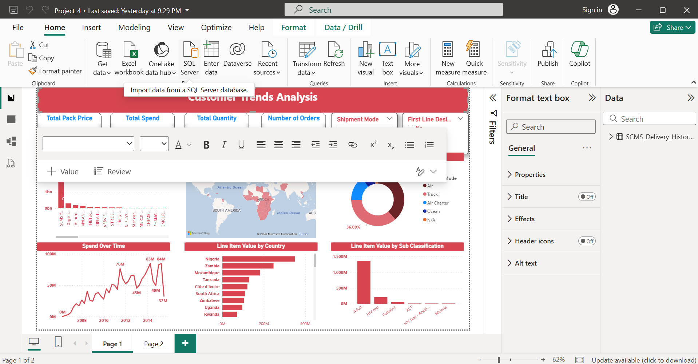

# Customer Trends Analysis Dashboard

An interactive Power BI dashboard built to analyse customer behaviour trends across region, product line, and salesperson — helping stakeholders spot patterns in spend, shipment mode, and order volume without digging through raw spreadsheets.

## 📊 Dashboard Preview

## 🚀 Overview

This dashboard consolidates raw sales and delivery data into a single, decision-ready view for non-technical stakeholders. It highlights spend trends over time, shipment mode distribution, top-performing countries by line item value, and sub-classification breakdowns — enabling faster, data-driven business decisions.

## 🎯 Key Results

- Shortened the stakeholder reporting cycle by roughly **30%**
- Built **8+ DAX measures** and KPI visualisations for non-technical audiences
- Identified top-performing regions, product lines, and salespeople through EDA, surfacing actionable insights for underperforming segments

## 🛠️ Tech Stack

- **Power BI** — dashboard design & interactivity
- **DAX** — custom measures and KPIs
- **SQL** — data extraction and transformation
- **Python** — data cleaning pipeline
- **Seaborn** — exploratory data analysis (EDA)

## 📁 What's Inside

- `Total Pack Price`, `Total Spend`, `Total Quantity`, `Number of Orders` — headline KPI cards
- **Shipment Mode** breakdown (Air, Truck, Air Charter, Ocean, N/A)
- **Spend Over Time** trend line (2008–2016)
- **Line Item Value by Country** — top countries by total value
- **Line Item Value by Sub Classification** — product-level breakdown
- Geographic map view of shipment activity across regions

## ⚙️ How It Works

1. Raw sales/delivery data cleaned and transformed using a SQL + Python pipeline
2. Cleaned data loaded into Power BI
3. Custom DAX measures created for KPIs (total spend, order counts, shipment mode %, etc.)
4. Interactive visuals and filters built for stakeholder self-service exploration

## 📌 Notes

This project was built as part of the AlmaBetter Data Analyst training program (Jan–Feb 2026).

## 📬 Contact

**Smruti Ranjan Patra**
📧 smrutiranjanpatra09@gmail.com
🔗 [LinkedIn](https://www.linkedin.com/in/smrutiranjanpatra09/)
🔗 [GitHub](https://github.com/smrutiranjanpatra09-arch)
